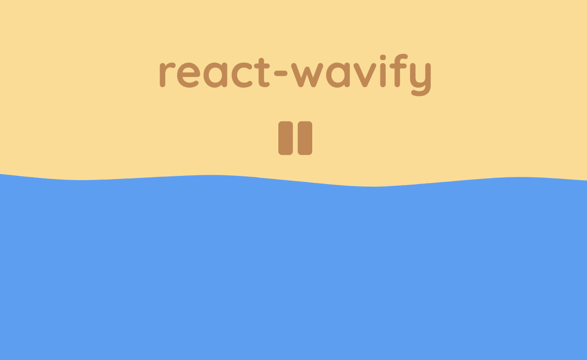
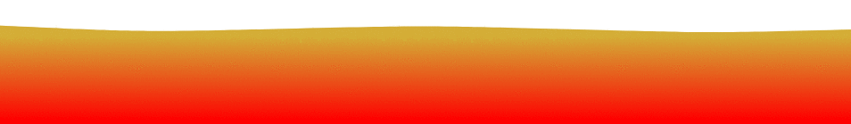

# React Wavify

[](https://github.com/woofers/react-wavify/actions) [](https://www.npmjs.com/package/react-wavify) [](https://www.npmjs.com/package/react-wavify) [](https://www.npmjs.com/package/react-wavify) [](https://bundlephobia.com/result?p=react-wavify) [](https://github.com/woofers/react-wavify/blob/master/LICENSE)

A simple React component which creates an animated wave.

**[Live Demo](https://jaxson.vandoorn.ca/react-wavify/)**

This component is heavily adapted from [Mikołaj Stolarski](https://github.com/grimor)'s awesome [Codepen](https://codepen.io/grimor/pen/qbXLdN)
and is functionally similar to [Benjamin Grauwin](http://benjamin.grauwin.me/)'s [Wavify](https://github.com/peacepostman/wavify) plug-in.




# Installation

**Yarn**

    yarn add react-wavify

**npm**

    npm install react-wavify


# Usage

```jsx
import React from 'react'
import Wave from 'react-wavify'

const App = () => (
  <Wave fill='#f79902'
        paused={false}
        options={{
          height: 20,
          amplitude: 20,
          speed: 0.15,
          points: 3
        }}
  />
)
```

Simply add the Wave component to the React application using JSX.

The wave's width will scale to fit the parent container.


## Props


### Fill

The `fill` property can be set to anything that a SVG path can accept (usually gradients or colors). **Default:** `#FFF`


### Paused

The `paused` property controls the play state of the animation. **Default:** `false`

If set to `true` the wave animation will pause.


### Options

The component supports a variety of options to affect how the wave is rendered.

Any omitted options will be set to the default value.

-   `height` - Height of the wave relative to the SVG element. **Default:** `20`
-   `amplitude` - Amplitude of the rendered wave. **Default:** `20`
-   `speed` - Speed that the wave animation plays at. **Default:** `0.15`
-   `points` - Amount of points used to form the wave.
    Can not be less than `1`. **Default:** `3`


### Pass Through Props

Any other props such as `id`, `className` or `style` will be passed through to the root of the component.

Other props such as `opacity` or `stroke` will be passed to the SVG path element.

Any other elements can be passed inside the SVG component itself.

Inner `<defs>` elements can be used to add gradients, clipping paths, or masks.

##### Using a Gradient

```jsx
<Wave fill="url(#gradient)">
  <defs>
    <linearGradient id="gradient" gradientTransform="rotate(90)">
      <stop offset="10%"  stopColor="#d4af37" />
      <stop offset="90%" stopColor="#f00" />
    </linearGradient>
  </defs>
</Wave>
```



##### Using a Clipping Path

```jsx
<Wave fill="#e62315" mask="url(#mask)" options={{ points: 20, speed: 0.2, amplitude: 40 }}>
  {/* Example adapted from https://developer.mozilla.org/en-US/docs/Web/SVG/Element/mask */}
  <mask id="mask">
    <path d="M10,35 A20,20,0,0,1,50,35 A20,20,0,0,1,90,35 Q90,65,50,95 Q10,65,10,35 Z" fill="white" />
  </mask>
</Wave>
```


##### Using a Mask

```jsx
<Wave mask="url(#mask)" fill="#1277b0" >
  <defs>
    <linearGradient id="gradient" gradientTransform="rotate(90)">
      <stop offset="0" stopColor="white" />
      <stop offset="0.5" stopColor="black" />
    </linearGradient>
    <mask id="mask">
      <rect x="0" y="0" width="2000" height="200" fill="url(#gradient)"  />
    </mask>
  </defs>
</Wave>
```


